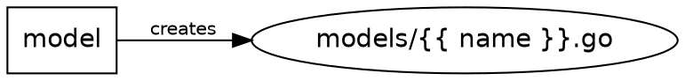

# tag template

Template management commands.

## Synopsis

```bash
tag template <subcommand> [args] [flags]
```

## Description

The `tag template` command group provides tools for managing templates, generators, and bundles. It consolidates template-related operations under a single namespace.

## Subcommands

| Subcommand | Description |
|------------|-------------|
| `tag template init` | Initialize a TAG directory structure |
| `tag template new generator <name>` | Create a new generator |
| `tag template new bundle <name>` | Create a new bundle |
| `tag template info <template>` | Show template metadata and details |
| `tag template lint [path]` | Validate template syntax, schema, and variable references |
| `tag template variables [path]` | Audit variable declarations and usage across template files |
| `tag template rename-var <old> <new> [path]` | Rename a variable across the config and all template files |
| `tag template graph [path]` | Visualize the generator dependency graph |
| `tag template list` | List available generators and bundles |

---

### `tag template init`

Initialize the `.tag/` directory structure in the current project. Use this when adding generators to an existing project that was not scaffolded by TAG.

```bash
tag template init
```

Creates:
```
.tag/
├── _shared/      # Shared template fragments
└── _bundles/     # Bundle definitions
```

See [tag template init](init.md) for full details.

---

### `tag template new generator`

Create a new generator template file.

```bash
tag template new generator <name> [flags]
```

| Flag | Short | Default | Description |
|------|-------|---------|-------------|
| `--package` | `-p` | `mypackage` | Package name for the generated Go file |
| `--lib` | `-l` | `false` | Create in the library template referenced by `.tagconfig.json` |
| `--in-bundle` | `-B` | | Create generator inside a bundle directory (for self-contained bundles) |

Flags may appear before or after `<name>`.

**Examples:**

```bash
# Create a generator locally
tag template new generator handler

# Create with a custom package name
tag template new generator handler -p api

# Create in a library template
tag template new generator handler --lib

# Create inside a self-contained bundle
tag template new generator handler --in-bundle my-bundle

# Flags may come before the name too
tag template new generator -p api handler
```

See [tag template new](new.md) for full details.

---

### `tag template new bundle`

Create a new bundle definition file.

```bash
tag template new bundle <name> [flags]
```

| Flag | Short | Default | Description |
|------|-------|---------|-------------|
| `--lib` | `-l` | `false` | Create in the library template referenced by `.tagconfig.json` |
| `--self-contained` | `-s` | `false` | Create bundle with `self_contained: true` (generators inside the bundle) |

Flags may appear before or after `<name>`.

**Examples:**

```bash
# Create a bundle locally
tag template new bundle feature

# Create a self-contained bundle
tag template new bundle examples --self-contained

# Create in a library template
tag template new bundle crud --lib

# Flags may come before the name too
tag template new bundle --self-contained examples
```

See [tag template new](new.md) for full details.

---

### `tag template info`

Show detailed information about a template, including variables, hooks, and metadata.

```bash
tag template info <template> [flags]
```

The `<template>` argument can be a local path, remote reference, or library template name. Exactly one is accepted — a second positional is a usage error, not silently ignored.

| Flag | Short | Default | Description |
|------|-------|---------|-------------|
| `--update` | `-u` | `false` | Force refresh of cached remote templates |
| `--format` | | `text` | Output format: `text` or `json` |

Flags may appear before or after `<template>`: `tag template info gh:user/awesome-template --update` and `tag template info --update gh:user/awesome-template` are equivalent.

**Examples:**

```bash
# Info for a local template
tag template info ./my-template

# Info for an installed library template
tag template info go-api

# Machine-readable output
tag template info go-api --format json

# Flags may come before or after the template argument
tag template info --format json go-api

# Force refresh of a cached remote template
tag template info gh:user/awesome-template --update
```

**Example output:**

```
Name:        go-api
Source:       gh:user/go-api-template
Path:         /Users/you/.local/share/tag/templates/go-api
Version:      v1.2.0
Description:  Go REST API template

Variables:
  author               (string)
  license              (choice: [MIT Apache-2.0 GPL-3.0])
  port                 = 8080
  project_name         (string)
  use_docker           (boolean)

Hooks:
  post_scaffold:
    - go mod tidy
    - git init

Generators:
  handler              Create a request handler
  model                Create a data model
  service              Create a service layer

Bundles:
  crud                 Model + handler + service
```

**Example JSON output** (`--format json`):

```json
{
  "schema_version": 1,
  "tag_version": "v2.3.0",
  "name": "go-api",
  "description": "Go REST API template",
  "version": "v1.2.0",
  "keywords": ["go", "rest", "api"],
  "categories": ["backend"],
  "variables": [
    { "name": "_build_stamp", "type": "string", "default": "{{ vars.author }}", "required": false, "secret": false, "depends_on": ["author"],
      "prompted": false, "derived": true, "private": true, "default_is_expression": true },
    { "name": "author", "type": "string", "prompt": "Author name", "required": true, "secret": false, "depends_on": [],
      "prompted": true, "derived": false, "private": false, "default_is_expression": false },
    { "name": "license", "type": "choice", "required": true, "options": ["MIT", "Apache-2.0", "GPL-3.0"], "secret": false, "depends_on": [],
      "prompted": true, "derived": false, "private": false, "default_is_expression": false },
    { "name": "port", "type": "number", "default": 8080, "required": false, "secret": false, "depends_on": [],
      "prompted": true, "derived": false, "private": false, "default_is_expression": false },
    { "name": "service_name", "type": "string", "default": "{{ vars.author }}-svc", "required": false, "secret": false, "depends_on": ["author"],
      "prompted": false, "derived": true, "private": false, "default_is_expression": true }
  ],
  "hooks": {
    "pre_scaffold": [],
    "post_scaffold": ["go mod tidy", "git init"]
  },
  "has_readme": true,
  "has_howto": false,
  "resolved_commit": "a1b2c3d4e5f6a1b2c3d4e5f6a1b2c3d4e5f6a1b2"
}
```

Bare object, no envelope. `variables` is sorted by name and reports the resolved variable definitions — the same values shown in the text output — not the raw declarations from `tag.template.json`. `hooks` always carries both `pre_scaffold` and `post_scaffold`, `[]` when a phase has no hooks. `has_readme` and `has_howto` are booleans only: README/HOWTO content is never included, and the ANSI formatting from the text view's rendered docs never appears in JSON. There is deliberately no `source` field. `--update` works the same way in JSON mode as in text mode. Each variable also carries four booleans describing what TAG does with it at scaffold time, so a form generator can decide whether to render an input: `private` (name starts with `_`), `derived` (the default is a template expression and no explicit `prompt` is declared), `prompted` (`!private && !derived` — the variable is asked for interactively), and `default_is_expression` (the `default` is raw template source rather than a literal, whether the variable is derived or has a prompt with an evaluated default). All four are always present, never omitted when `false`. `default` is reported verbatim: `info` has no values to resolve expressions against, so `default_is_expression` is what tells a consumer not to render the default literally.

`keywords` and `categories` mirror the same-named `tag.template.json` fields (see
[tag.template.json Reference](../reference/tag.template.json.md)) — `[]` when the template
declares neither.

`resolved_commit` is the git SHA the reference resolved to. It is always present, never omitted:
for a library template, a local directory, or a zip there is no commit to report and the field is
`""` (empty, not absent) — that is how a consumer distinguishes "no commit for this kind of
source" from "this binary predates the field". For a git remote reference it is populated the same
way on a fresh fetch and on a cache hit.

`depends_on`, on each variable, lists the declared variables that variable's default expression
references — sorted alphabetically, `[]` when there are none. It is computed only when the default
is an actual template expression (contains both `{{` and `vars.`); a statement-only default
(``) or a subscript default (`{{ vars["x"] }}`) is a literal string that TAG never
renders, so it gets `[]` too, consistent with `default_is_expression`. Undeclared names are
dropped. The `variables` array itself stays sorted alphabetically by name — it does not change
order — so `depends_on` is what lets a consumer reconstruct the same topological order
`tag scaffold` uses when prompting.

`schema_version` and `tag_version` are covered in full, including the bump policy, in the
[JSON Contract reference](../reference/json-contract.md).

---

### `tag template lint`

Validate a scaffold template for correctness. Checks `tag.template.json` against the JSON Schema, parses all template files for Gonja syntax errors, and verifies that `{{ vars.* }}` references match declared variables.

```bash
tag template lint [path] [flags]
```

If `[path]` is omitted, the current directory is used.

| Flag | Short | Default | Description |
|------|-------|---------|-------------|
| `--format` | `-f` | `text` | Output format: `text` or `json` |

**Exit codes:**

| Code | Meaning |
|------|---------|
| `0` | All checks passed |
| `1` | Lint errors found |
| `2` | Usage error (bad arguments, missing config) |

**Examples:**

```bash
# Lint the current directory
tag template lint

# Lint a specific template
tag template lint ./path/to/template

# Machine-readable output for CI
tag template lint --format json

# Flags may come before or after the path
tag template lint ./path/to/template --format json
```

**Example text output:**

```
  tag.template.json  ERROR  config parse error: invalid JSON  (config-parse)
  main.go.tmpl:5  ERROR  undefined variable "db_name"  (undefined-variable)

  2 error(s)
```

**What is checked:**

- **Schema validation** — `tag.template.json` is validated against the TAG JSON Schema.
- **Config parsing** — The config file must be valid JSON and match the expected structure.
- **Template syntax** — All text files are parsed by the Gonja engine (parse-only, no execution).
- **Variable cross-reference** — Every `{{ vars.X }}` and `` reference is checked against the variables declared in `tag.template.json`.
- **Derived variable defaults** — Derived variables referencing other undefined variables are flagged.
- **Path placeholders** — Directory and file names containing `{{ vars.* }}` are checked.
- **Binary files** — Automatically skipped.
- **`.tagignore` patterns** — Ignored files are excluded from linting.
- **Comments, raw blocks, and string literals** — Template comments (`{# ... #}`), the body of `...` blocks, and string literals inside a `{{ }}` / `` block are never scanned for references, so `{{ replace("{{ vars.ghost }}") }}` does not reference `ghost`. A `` tag's own opening tag is scanned like any other block — only its body is skipped. `tag template lint`, `tag template variables`, and `tag template rename-var` share this exact definition of a reference. Both dot access (`vars.name`) and literal subscript access (`vars["name"]` / `vars['name']`, whitespace-tolerant) count as references; a non-literal subscript (`vars[expr]`) does not, because the key is not statically known. `vars.0` is read as index access, not a variable named `0`.

**Example JSON output** (`--format json`):

```json
{
  "issues": [
    {
      "file": "bad.txt",
      "line": 1,
      "severity": "error",
      "message": "undefined variable \"undefined_thing\"",
      "rule": "undefined-variable"
    }
  ]
}
```

`{"issues":[...]}`, `[]` when the template is clean. `line` and `column` are `omitempty` — a
schema or config-parse issue has no line to point to, so they are absent rather than `0` (a path
placeholder issue omits them the same way `template variables`' `undeclared` entries do). `severity`
is always `"error"` or `"warning"`; `rule` is the machine-readable rule name shown in parentheses
in the text output (e.g. `undefined-variable`, `config-parse`).

---

### `tag template variables`

Audit variable declarations and usage across all template files. Cross-references `tag.template.json` declarations with `{{ vars.* }}` references in templates. Also scans generator-level configs inside `_generators/`.

```bash
tag template variables [path] [flags]
tag template vars [path] [flags]   # alias
```

If `[path]` is omitted, the current directory is used.

| Flag | Default | Description |
|------|---------|-------------|
| `--format` | `text` | Output format: `text` or `json` |
| `--strict` | `false` | Exit with non-zero status when undeclared or unused variables are found |

**Exit codes:**

| Code | Meaning |
|------|---------|
| `0` | Analysis completed (or no issues when `--strict`) |
| `1` | Issues found (`--strict` mode only) |
| `2` | Usage error (bad arguments, missing config) |

**Examples:**

```bash
# Audit the current directory
tag template variables

# Audit a specific template
tag template variables ./my-template

# Machine-readable output for CI
tag template variables --format json

# Flags may come before or after the path
tag template variables ./my-template --format json

# Fail CI when issues found
tag template variables --strict
```

**Example text output:**

```
Variables declared in tag.template.json:
  author          (string, required)              — used in 3 file(s), 4 reference(s)
  port            (number, default: 8080)         — used in 4 file(s), 6 reference(s)
  project_name    (string, required)              — used in 12 file(s), 23 reference(s)
  use_docker      (boolean, default: true)        — used in 2 file(s), 3 reference(s)
  _slug           (derived)                       — used in 8 file(s), 15 reference(s)

No undeclared variables.

No unused variables.

Summary: 5 declared, 0 undeclared, 0 unused
```

**What is scanned:**

- `{{ vars.x }}` references in template file bodies
- `{{ vars.x }}` references in directory name placeholders
- `` conditional references
- `` iteration references
- Derived variable default expressions (`"default": "{{ vars.other }}"`)
- Generator-level `tag.template.json` configs
- Template comments (`{# ... #}`), the body of `...` blocks, and string literals inside a `{{ }}` / `` block are never scanned — a variable referenced only inside one of them counts as unused, not used. A `` tag's own opening tag is scanned like any other block — only its body is skipped. `tag template variables` shares this exact definition of a reference with `tag template lint` and `tag template rename-var`: dot access (`vars.name`) and literal subscript access (`vars["name"]` / `vars['name']`) both count, a non-literal subscript (`vars[expr]`) does not, and `vars.0` is read as index access, not a variable named `0`.
- Binary files and `.tagignore` patterns are honored

**Example JSON output** (`--format json`):

```json
{
  "root": {
    "scope": "root",
    "declared": [
      {
        "name": "project_name",
        "type": "string",
        "default": "demo-proj",
        "file_count": 2,
        "reference_count": 2,
        "references": [
          { "file": "README.md", "line": 1, "expression": "hello {{ vars.project_name }}" }
        ]
      }
    ],
    "undeclared": [
      { "name": "feature", "references": [{ "file": "cond/feat.txt", "line": 0, "expression": "" }] }
    ],
    "unused": [],
    "summary": { "declared": 1, "undeclared": 1, "unused": 0 }
  },
  "generators": []
}
```

Bare object, no envelope, keyed by scope. `root` covers the top-level template; `generators` is one
entry per generator-level config under `_generators/`. `declared`, `undeclared`, `unused`, and
`generators` are always arrays — `[]` when empty, never `null`. An `undeclared` reference found in
a path placeholder (rather than a template body) reports `line: 0` and an empty `expression`.
`summary` mirrors the array lengths.

---

### `tag template rename-var`

Rename a template variable everywhere the template refers to it — the declaration, every expression, and file or directory name placeholders (which are renamed on disk).

```bash
tag template rename-var <old-name> <new-name> [path] [flags]
```

If `[path]` is omitted, the current directory is used. Flags may appear before or after the positional arguments. A `[path]` beginning with a dash would be read as a flag, so pass it after a `--` separator (`tag template rename-var old new -- --odd-dir-name`).

| Flag | Default | Description |
|------|---------|-------------|
| `--dry-run` | `false` | Preview every change without modifying anything |

**What is rewritten:**

| Location | Example |
|----------|---------|
| `tag.template.json` declaration | `"old_name": { ... }` → `"new_name": { ... }` |
| Derived variable defaults | `"default": "{{ vars.old_name \| kebab }}"` |
| Hook commands | `"post_scaffold": ["echo {{ vars.old_name }}"]` |
| Bundle and generator `requires` | `"requires": ["old_name"]` |
| Template bodies | `{{ vars.old_name }}`, `{{ vars.old_name \| f1 \| f2 }}` |
| Frontmatter `to:` paths | `to: {{ vars.old_name \| snake }}/main.go` |
| Conditionals and loops | ``, `` |
| File and directory placeholders | `{{ vars.old_name \| snake }}/main.go` (renamed on disk) |

**What is left alone:**

- Plain text that merely mentions the name — only Gonja expressions are rewritten
- Comments (`{# ... #}`)
- The body of a `...` block, whose contents are emitted literally — the opening `` tag itself is an ordinary block and is rewritten like any other
- String literals inside an expression, such as `{{ "vars.old_name" }}`
- Files excluded by `.tagignore`, the `_dialects/` tree, symlinks, and binary files

`_generators/` and `.tag/` **are** included, because generators inherit root-level variables and bundle manifests reference them by name.

**Exit codes:**

| Code | Meaning |
|------|---------|
| `0` | Rename applied (or previewed with `--dry-run`) |
| `1` | Rename failed — the variable is not declared, the new name is taken or invalid, or a renamed path would collide |
| `2` | Usage error (wrong number of arguments) |

**Examples:**

```bash
# Preview first — always a good idea
tag template rename-var --dry-run project_name service_name

# Apply
tag template rename-var project_name service_name

# Rename in a specific template
tag template rename-var old_flag new_flag ./my-template

# Flags may come after the positional arguments too
tag template rename-var project_name service_name --dry-run
```

**Example dry-run output:**

```
Renaming "project_name" → "service_name"

Changes:

  README.md:1
    - # {{ vars.project_name }}
    + # {{ vars.service_name }}

  go.mod:1
    - module {{ vars.project_name | kebab }}
    + module {{ vars.service_name | kebab }}

  tag.template.json:4
    -     "project_name": { "type": "string", "prompt": "Project name" },
    +     "service_name": { "type": "string", "prompt": "Project name" },

  {{ vars.project_name | snake }}/main.go (path placeholder):
    - {{ vars.project_name | snake }}/main.go
    + {{ vars.service_name | snake }}/main.go

  4 files, 5 replacements total
```

**Safety:**

- Planning is read-only, so `--dry-run` cannot modify the template.
- An apply that fails partway restores every file and path it had already changed, so a half-renamed template never survives the command.
- Run `tag template lint` afterwards to confirm nothing was missed.

**Limitations:**

- Dot access (`vars.old_name`) and literal subscript access (`vars["old_name"]` / `vars['old_name']`, whitespace-tolerant) are both rewritten — the same references `tag template lint` and `tag template variables` recognise. A non-literal subscript (`vars[expr]`) is left alone, because its key is not statically known.
- A name must start with a letter or underscore. `vars.0` is read as index access, not a variable named `0`, and is never renamed.

---

### `tag template graph`

Visualize the dependency graph between generators — which files they create, inject into, or
append to, and in what order bundles run them.

```bash
tag template graph [path] [flags]
```

If `[path]` is omitted, the current directory is used.

| Flag | Default | Description |
|------|---------|-------------|
| `--format` | `text` | Output format: `text`, `json`, or `dot` |

`tag template graph` takes at most one path argument; a second positional is a usage error (exit `2`).

**Examples:**

```bash
tag template graph
tag template graph ./my-template
tag template graph --format json
tag template graph --format dot | dot -Tpng -o graph.png
```

**What is analyzed**, reading each generator's frontmatter:

- **Generators** — every generator with its actions (`create`, `inject`, `append`) and target paths.
- **Bundles** — each bundle's generator execution order, flagged valid or invalid (a bundle is invalid when a generator injects into a file that a *later* generator in the same bundle creates).
- **Injection markers** — marker strings found in the project's source files, with line numbers and the generators that reference them. Skips `.tag/`, `_generators/`, dotfiles, and binary files.

**Example JSON output** (`--format json`):

```json
{
  "generators": [
    {
      "name": "model",
      "actions": [
        { "type": "create", "target": "models/{{ name }}.go" }
      ]
    }
  ],
  "bundles": [],
  "markers": [],
  "warnings": [
    { "code": "malformed_metadata", "generator": "route", "message": "cannot parse metadata in routes.go.tmpl: inject action requires before or after clause" }
  ]
}
```

`generators`, `bundles`, `markers`, and `warnings` are always arrays — `[]` when there is nothing
to report. `generators[].actions[].marker`/`position` are present only on inject actions.
`bundles[].order` lists generator names in execution order with a `valid_order` boolean.
`markers[].used_by` lists the generator names that inject at that marker.

**Warning codes** (`warnings[].code`):

| Code | Meaning |
|------|---------|
| `file_conflict` | Two or more generators create the same target file |
| `missing_target` | A generator injects into a file no generator creates (may come from the scaffold itself) |
| `order_violation` | A bundle injects into a file before the generator that creates it |
| `malformed_metadata` | A template's frontmatter could not be extracted or parsed |

Targets containing `{{ ... }}` are skipped by `missing_target`, since they cannot be resolved statically.

**Exit codes:**

| Code | Meaning |
|------|---------|
| `0` | Analysis completed — even with warnings present. `graph` reports; it does not gate. |
| `2` | Usage error (unknown `--format`, more than one path argument) |

**`--format dot`:**

```bash
tag template graph --format dot
```



Pipe directly into Graphviz's `dot` to render an image: `tag template graph --format dot | dot -Tpng -o graph.png`.

---

### `tag template list`

List all available generators and bundles for the current project.

```bash
tag template list
tag template ls    # alias
tag template list --all             # include generators/bundles with unmet requirements
tag template list --format json     # Machine-readable output
```

This is equivalent to `tag generate list` — both show the same output, in both formats.

| Flag | Description |
|------|-------------|
| `--all` | Show all generators/bundles, including those with unmet requirements |
| `--format <fmt>` | Output format: `text` (default) or `json` |

Output shows generators grouped by source (template library vs local project) and bundles.

**Example output:**

```
Generators for this project (template: gh:acme/nextjs-starter@v1.2.0)

  TEMPLATE GENERATORS (nextjs-starter)
  component            Create a React component
  page                 Create a new page/route
  api                  Create an API endpoint

  PROJECT GENERATORS
  custom-hook          Custom React hook generator

  BUNDLES
  feature              Component + page + test (template)

Run: tag generate <name> <target> [args]
```

**Machine-readable output:**

```bash
tag template list --format json
```

```json
{
  "generators": [
    { "name": "component", "description": "Create a React component", "requirements_met": true }
  ],
  "bundles": [
    { "name": "feature", "description": "Component + page + test (template)", "generators": ["component", "page"], "requirements_met": true }
  ]
}
```

`generators` and `bundles` are always arrays, `[]` when empty, never `null`. A generator or bundle with unmet requirements is omitted unless `--all` is passed, in which case it appears with `requirements_met: false` — the JSON equivalent of the text output's `[requires: x, y]` suffix.

There is deliberately no per-generator `"bundle"` field: the data model records which generators belong to a bundle, not the reverse, so a single owning bundle can't be substantiated. Which bundle owns a generator is derivable from `bundles[].generators`.

## See Also

- [tag generate](generate.md) - Run generators and bundles
- [tag scaffold](scaffold.md) - Create new projects from templates
- [tag lib](lib.md) - Manage the template library
- [Template Authoring](../templates/authoring.md) - Creating templates
- [JSON Contract](../reference/json-contract.md) - `--format json` version keys and bump policy
